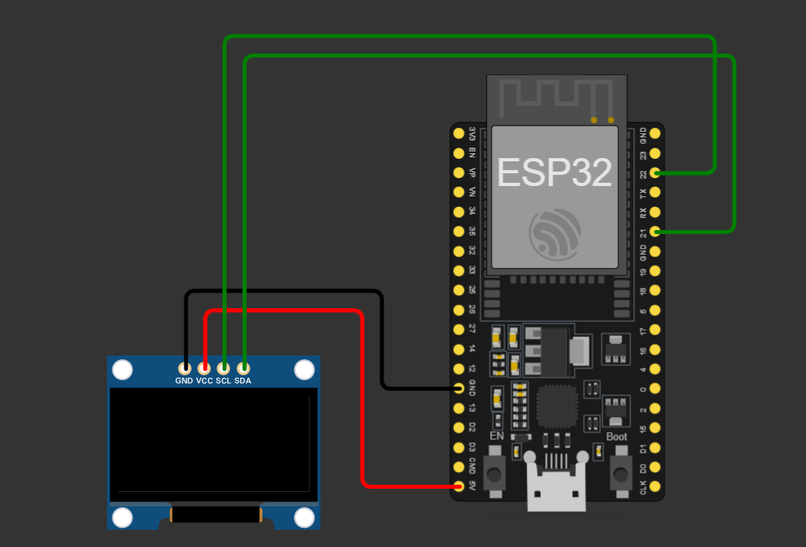

# ESP32 Weather Station với OLED SH1106

Trạm thời tiết mini sử dụng **ESP32** và màn hình **OLED SH1106 (1.3" I2C)**, hiển thị **giờ thực (NTP)**, **nhiệt độ** và **độ ẩm** theo thời gian thực, lấy dữ liệu miễn phí từ **Open-Meteo API**.

## Demo hiển thị

Màn hình OLED hiển thị:
```
Weather Tokyo
Time: 14:23:07
Temp: 27.30 C
Hum: 65 %
```

## Tính năng

- Kết nối WiFi tự động, hiển thị trạng thái kết nối trên OLED
- Lấy dữ liệu thời tiết (nhiệt độ, độ ẩm) từ [Open-Meteo API](https://open-meteo.com/) — không cần API key
- Đồng bộ giờ thực qua NTP (múi giờ GMT+7)
- Tự động cập nhật dữ liệu thời tiết mỗi 15 giây
- Chân I2C (SDA/SCL) có thể tùy chỉnh dễ dàng trong code

## Phần cứng sử dụng

| Linh kiện       | Số lượng |
|-----------------|----------|
| ESP32 DevKit V1  | 1        |
| Màn hình OLED SH1106 1.3" (I2C) | 1 |
| Dây jumper       | 4        |

## Sơ đồ đấu nối (Wiring)

| OLED SH1106 | ESP32          | Màu dây (gợi ý) |
|-------------|----------------|-----------------|
| GND         | GND            | Đen             |
| VCC         | 5V (VIN)       | Đỏ              |
| SCL         | GPIO 22        | Xanh lá         |
| SDA         | GPIO 21        | Xanh lá         |

> **Lưu ý:** Đây là chân mặc định của ESP32 cho giao tiếp I2C. Bạn hoàn toàn có thể đổi sang chân GPIO khác phù hợp với board của mình — xem phần [Tùy chỉnh chân SDA/SCL](#tùy-chỉnh-chân-sdascl) bên dưới.



## Yêu cầu thư viện (Arduino IDE)

Cài đặt các thư viện sau qua **Library Manager**:

- `WiFi` (có sẵn trong ESP32 core)
- `HTTPClient` (có sẵn trong ESP32 core)
- `WiFiClientSecure` (có sẵn trong ESP32 core)
- `ArduinoJson` (Benoit Blanchon)
- `NTPClient` (Fabrice Weinberg)
- `Adafruit GFX Library`
- `Adafruit SH110X`

## Cài đặt & Sử dụng

1. Clone hoặc tải project về:
   ```bash
   git clone https://github.com/username/esp32-weather-oled.git
   ```
2. Mở file `ESP32_Weather_OLED.ino` bằng Arduino IDE.
3. Cài đặt board **ESP32** trong Arduino IDE (nếu chưa có), chọn đúng board (VD: `ESP32 Dev Module`).
4. Cài đặt đầy đủ các thư viện ở mục trên.
5. Sửa thông tin WiFi trong code:
   ```cpp
   const char* ssid = "TEN_WIFI_CUA_BAN";
   const char* password = "MAT_KHAU_WIFI";
   ```
6. (Tùy chọn) Sửa tọa độ trong `serverPath` để lấy thời tiết đúng vị trí bạn muốn (mặc định đang là Tokyo).
7. Nạp code vào ESP32 và mở Serial Monitor (baud `115200`) để theo dõi.

## Tùy chỉnh chân SDA/SCL

Trong code, phần khai báo chân I2C được đặt ở đầu file để dễ chỉnh sửa:

```cpp
#define I2C_SDA_PIN 21   // Đổi số này nếu bạn nối dây SDA vào chân khác
#define I2C_SCL_PIN 22   // Đổi số này nếu bạn nối dây SCL vào chân khác
```

Và được áp dụng khi khởi tạo I2C trong `setup()`:

```cpp
Wire.begin(I2C_SDA_PIN, I2C_SCL_PIN);
```

Nếu bạn đấu OLED vào các chân khác (ví dụ GPIO 4 và GPIO 5), chỉ cần đổi 2 giá trị trên cho khớp với sơ đồ đấu dây thực tế, không cần sửa chỗ nào khác trong code.

## Cấu hình vị trí thời tiết

Mặc định tọa độ trong code là Tokyo (`latitude=35.6895&longitude=139.6917`). Để đổi sang vị trí khác, thay tọa độ trong biến `serverPath`:

```cpp
const String serverPath = "https://api.open-meteo.com/v1/forecast?latitude=<LAT>&longitude=<LON>&current=temperature_2m,relative_humidity_2m";
```

Bạn có thể tra tọa độ tại [latlong.net](https://www.latlong.net/).

## Cấu trúc thư mục

```
esp32-weather-oled/
├── ESP32_Weather_OLED.ino
├── wiring_diagram.png
└── README.md
```

## License

MIT License — tự do sử dụng, chỉnh sửa và phân phối.
